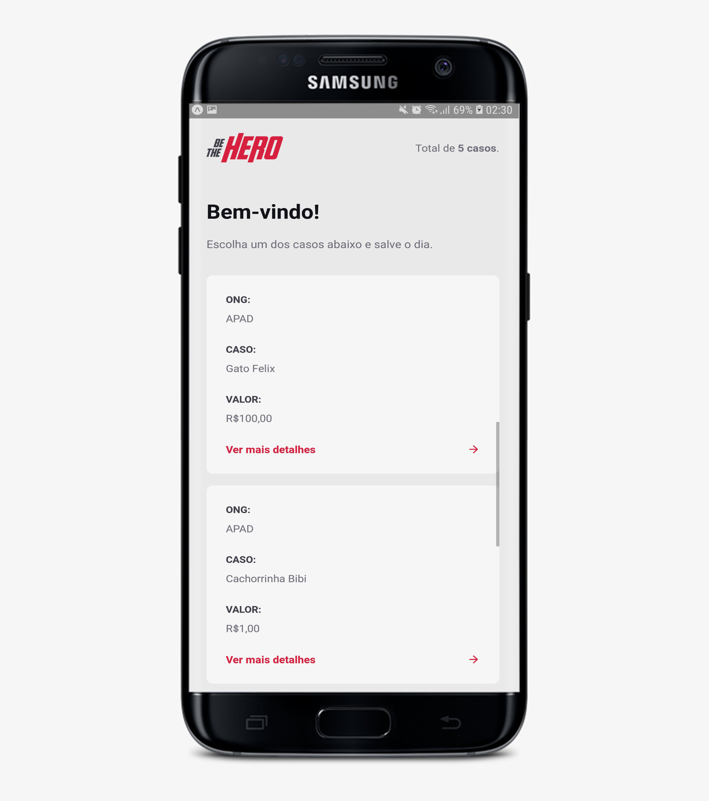

<h1 align="center">
  
</h1>

<div align="center">
  <h3>
    Application developed during the week omnistack
  </h3>
  <h4>
    Project to list ONGs and their incidents
  </h4>
</div>


<p align="center">
  <a href="#pencil-about-the-project">About the project</a>&nbsp;&nbsp;&nbsp;|&nbsp;&nbsp;&nbsp;
  <a href="#rocket-upgrades">Upgrades</a>&nbsp;&nbsp;&nbsp;|&nbsp;&nbsp;&nbsp;
  <a href="#hammer-technology">Technology</a>&nbsp;&nbsp;&nbsp;|&nbsp;&nbsp;&nbsp;
  <a href="#wrench-installation">Installation</a>&nbsp;&nbsp;&nbsp;
</p>

## :pencil: About the project

Be the hero is an application that which aims to integrate ONGs with people who are willing to help the next.

The project was developed in the week omnistack 11.0 <a href="https://rocketseat.com.br">Rocketseat</a>

<p align="center">
    
    
    

  <div style="display: inline-block; margin: 0 auto;">
    
    
  </div>
</p>

## :hammer: Technology

- [Node.js](https://nodejs.org/)
- [Express](https://expressjs.com/)
- [Nodemon](https://nodemon.io/)
- [Jest](https://jestjs.io/)
- [Knex](http://knexjs.org/)
- [SQLite](https://www.sqlite.org/index.html)
- [ReactJS](https://reactjs.org/)
- [Styled-components](https://www.styled-components.com/)
- [React Native](https://facebook.github.io/react-native/)
- [EXPO](https://expo.io/)
- [React Navigation](https://reactnavigation.org/)
- [Axios](https://github.com/axios/axios)
- [React-icons](https://react-icons.netlify.com/)
- [VS Code](https://code.visualstudio.com/)

## :wrench: Installation

### :satellite: Backend

```
  // 1 - Git Clone
  git clone https://github.com/thallis-andre/Be-The-Hero

  // 2 - Go into the backend folder
  cd be-the-hero/backend

  // 3 - Install the dependencies
  yarn install

  // 4 - Run the application
  yarn dev

```

### :computer: Web

```
  // 1 - Git Clone
  git clone https://github.com/thallis-andre/Be-The-Hero

  // 2 - Installing the dependencies
  yarn install

  // 3 - Run the application (Be sure to have the API running locally)
  yarn start

```

### :smartphone: Mobile

```
  // 1 - Git Clone
  git clone https://github.com/thallis-andre/Be-The-Hero

  // 2 - Installing the project (Be sure to have installed the react native cli)
   yarn install

   // If you're going to emulate with android - run this command
   yarn android
   // If you're going to emulate with ios - run this command
   yarn ios

```

_The application was tested using the Android Studio emulator_


Made with ♥ by Thallis :wave: 
